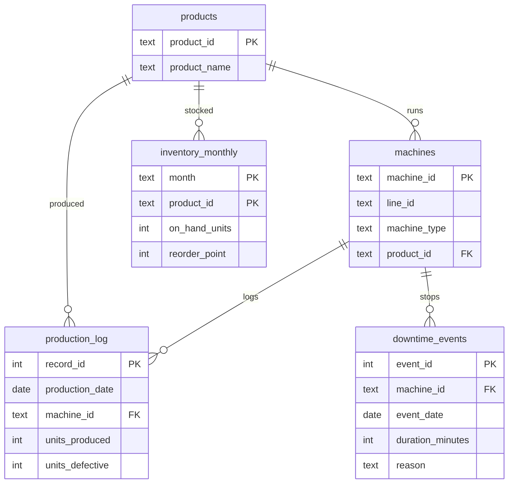

# Manufacturing Quality & Downtime Analysis (SQL)

A SQL mini-project that answers practical business questions about product quality, machine downtime and inventory risk for a fictional discrete-manufacturing plant.

**Tools:** SQL (SQLite) · Python (pandas, for loading data only) · Git/GitHub
**Skills shown:** joins, aggregation, CTEs, window functions (`LAG`, running totals), CASE logic, data-quality thinking, translating results into business recommendations.

> **About the data.** The dataset is **synthetic** - generated with `data/generate_data.py` (fixed random seed) to mimic one year (2025) of plant data: 12 machines on 4 production lines, 6 products, daily production counts, downtime events and month-end inventory. It is not real company data. The same queries work on any real manufacturing-defects dataset with a similar shape (e.g. from Kaggle) after a small mapping step.

---

## Headline findings

| # | Business question | Answer |
|---|---|---|
| 1 | Which product has the highest defects? | **Hydraulic Valve Body (P300)** - 3.87% defect rate vs. ~1.5-1.9% for the other products |
| 2 | Which month had the highest downtime? | **2025-07** - 32.7 hours across 46 events |
| 3 | Which machine needs investigation? | **C-02** (CNC Mill, Line C) - 4.4% defects (2.1x the machine average) and 2.57x average downtime |

Supporting analysis (Q4-Q7) shows the problem is concentrated on Line C, that it worsened from July to October, and that it is starting to threaten stock of the affected product.

---

## Data model



| Table | Rows | Grain |
|---|---|---|
| `production_log` | 3,132 | one machine, one weekday |
| `downtime_events` | 359 | one stoppage |
| `machines` / `products` | 12 / 6 | reference data |
| `inventory_monthly` | 72 | one product, one month-end |

---

## How to run

```bash
pip install pandas
python build_db.py        # builds manufacturing.db, runs all queries, writes results/q1.csv ... q7.csv
```
Or open `manufacturing.db` in DB Browser for SQLite / DBeaver and paste queries from `sql/02_analysis_queries.sql`.

```
.
├── data/                 CSV files + generate_data.py
├── sql/
│   ├── 01_schema.sql     table definitions, keys, indexes
│   └── 02_analysis_queries.sql
├── results/              query outputs (q1.csv ... q7.csv)
├── build_db.py           loads CSVs into SQLite and runs the queries
└── manufacturing.db
```

---

## The three core questions

### Q1. Which product has the highest defects?
Both count and rate are shown on purpose: raw counts favour high-volume products, the rate shows true quality.

```sql
SELECT  p.product_id,
        p.product_name,
        SUM(pl.units_produced)                                         AS units_produced,
        SUM(pl.units_defective)                                        AS units_defective,
        ROUND(100.0 * SUM(pl.units_defective) / SUM(pl.units_produced), 2) AS defect_rate_pct
FROM    production_log pl
JOIN    products p ON p.product_id = pl.product_id
GROUP BY p.product_id, p.product_name
ORDER BY defect_rate_pct DESC;
```
| product_id | product_name | units_produced | units_defective | defect_rate_pct |
|---|---|---|---|---|
| P300 | Hydraulic Valve Body | 176,048 | 6,812 | 3.87 |
| P600 | Cover Plate | 318,406 | 6,107 | 1.92 |
| P200 | Motor Housing | 200,354 | 3,777 | 1.89 |
| P100 | Steel Bracket | 248,300 | 4,211 | 1.7 |
| P400 | Sensor Mount | 278,092 | 4,648 | 1.67 |
| P500 | Gear Shaft | 185,736 | 2,854 | 1.54 |

**Finding:** The Hydraulic Valve Body's defect rate is roughly **double** every other product. It is made on Line C, which leads into Q3. (Cover Plate has the second-most defective units, but only because of its high volume - its rate is normal.)

### Q2. Which month had the highest downtime?

```sql
SELECT  strftime('%Y-%m', event_date)            AS month,
        COUNT(*)                                 AS downtime_events,
        SUM(duration_minutes)                    AS total_downtime_min,
        ROUND(SUM(duration_minutes) / 60.0, 1)   AS total_downtime_hours
FROM    downtime_events
GROUP BY month
ORDER BY total_downtime_min DESC;
```
| month | downtime_events | total_downtime_min | total_downtime_hours |
|---|---|---|---|
| 2025-07 | 46 | 1,961 | 32.7 |
| 2025-08 | 39 | 1,615 | 26.9 |
| 2025-10 | 33 | 1,519 | 25.3 |
| 2025-11 | 27 | 1,322 | 22.0 |
| 2025-06 | 28 | 1,314 | 21.9 |
*(top 5 of 12 months shown - full output in `results/q2.csv`)*

**Finding:** **July** is the worst month, about 20% above the next-worst month. Q3 and Q6 show which machine drove it.

### Q3. Which machine needs investigation?
Approach: calculate each machine's defect rate and downtime, compare with the plant average, and flag machines that are worse than average on **both** measures. A machine that is bad on only one measure may just be busy or unlucky; bad on both points to a root-cause problem.

```sql
WITH quality AS (
    SELECT machine_id,
           SUM(units_produced)  AS units,
           SUM(units_defective) AS defects,
           100.0 * SUM(units_defective) / SUM(units_produced) AS defect_rate_pct
    FROM production_log
    GROUP BY machine_id
),
downtime AS (
    SELECT machine_id,
           COUNT(*)              AS events,
           SUM(duration_minutes) AS downtime_min
    FROM downtime_events
    GROUP BY machine_id
),
combined AS (
    SELECT m.machine_id, m.line_id, m.machine_type,
           q.defect_rate_pct,
           COALESCE(d.events, 0)       AS downtime_events,
           COALESCE(d.downtime_min, 0) AS downtime_min
    FROM machines m
    JOIN quality q        ON q.machine_id = m.machine_id
    LEFT JOIN downtime d  ON d.machine_id = m.machine_id
)
SELECT  machine_id, line_id, machine_type,
        ROUND(defect_rate_pct, 2)                                     AS defect_rate_pct,
        downtime_events,
        downtime_min,
        ROUND(defect_rate_pct / (SELECT AVG(defect_rate_pct) FROM combined), 2) AS defect_vs_avg_x,
        ROUND(1.0 * downtime_min / (SELECT AVG(downtime_min) FROM combined), 2) AS downtime_vs_avg_x,
        CASE WHEN defect_rate_pct > (SELECT AVG(defect_rate_pct) FROM combined)
              AND downtime_min    > (SELECT AVG(downtime_min)    FROM combined)
             THEN 'INVESTIGATE' ELSE 'ok' END                         AS status
FROM    combined
ORDER BY defect_vs_avg_x + downtime_vs_avg_x DESC;
```
| machine_id | line_id | machine_type | defect_rate_pct | downtime_events | downtime_min | defect_vs_avg_x | downtime_vs_avg_x | status |
|---|---|---|---|---|---|---|---|---|
| C-02 | C | CNC Mill | 4.4 | 55 | 3,209 | 2.1 | 2.57 | INVESTIGATE |
| C-01 | C | CNC Mill | 3.33 | 28 | 1,015 | 1.59 | 0.81 | ok |
| B-03 | B | Stamping Press | 2.05 | 37 | 1,600 | 0.98 | 1.28 | ok |
| C-03 | C | CNC Lathe | 2.17 | 32 | 1,142 | 1.03 | 0.91 | ok |
| B-01 | B | Press Brake | 1.97 | 29 | 1,110 | 0.94 | 0.89 | ok |
*(top 5 of 12 machines shown)*

**Finding:** **C-02** is the only machine flagged. Its defect rate is 2.1x average and its downtime is 2.57x average. C-01 (same line, same product) is also elevated on defects but not on downtime - worth checking whether they share tooling, material or a programme.

---

## Supporting analysis

### Q4. Is Line C getting worse? (window function: month-over-month change)
| line_id | month | defect_rate_pct | mom_change_pts |
|---|---|---|---|
| C | 2025-01 | 2.84 |  |
| C | 2025-02 | 3.02 | 0.18 |
| C | 2025-03 | 2.85 | -0.17 |
| C | 2025-04 | 2.85 | 0.01 |
| C | 2025-05 | 2.72 | -0.13 |
| C | 2025-06 | 2.83 | 0.12 |
| C | 2025-07 | 3.38 | 0.55 |
| C | 2025-08 | 3.69 | 0.31 |
| C | 2025-09 | 4.06 | 0.37 |
| C | 2025-10 | 4.35 | 0.29 |
| C | 2025-11 | 3.27 | -1.08 |
| C | 2025-12 | 3.05 | -0.22 |

**Finding:** Line C held steady at roughly 2.7-3.0% until June, then climbed four months in a row to **4.35% in October** before recovering in November. The November drop suggests something changed (repair, recalibration or retraining) - worth confirming with maintenance logs.

### Q5. Why is C-02 stopping? (Pareto with running totals)
| reason | events | minutes | pct_of_total | cumulative_pct |
|---|---|---|---|---|
| Sensor fault | 15 | 712 | 22.2 | 22.2 |
| Operator unavailable | 9 | 612 | 19.1 | 41.3 |
| Material jam | 7 | 570 | 17.8 | 59.0 |
| Scheduled maintenance | 6 | 446 | 13.9 | 72.9 |
| Tool wear | 11 | 369 | 11.5 | 84.4 |
| Changeover | 5 | 314 | 9.8 | 94.2 |
| Power/utility issue | 2 | 186 | 5.8 | 100.0 |

**Finding:** Sensor faults are the largest single cause, followed by "operator unavailable" - a staffing/scheduling issue rather than a machine issue. Together with material jams these account for ~59% of C-02 downtime, so fixing two or three causes could remove more than half of the lost time.

### Q6. Do downtime and defects move together? (C-02, by month)
| month | defect_rate_pct | downtime_min |
|---|---|---|
| 2025-01 | 3.44 | 152 |
| 2025-02 | 3.74 | 231 |
| 2025-03 | 3.42 | 70 |
| 2025-04 | 3.56 | 32 |
| 2025-05 | 3.34 | 73 |
| 2025-06 | 3.52 | 286 |
| 2025-07 | 4.66 | 859 |
| 2025-08 | 5.37 | 429 |
| 2025-09 | 6.28 | 113 |
| 2025-10 | 6.71 | 535 |
| 2025-11 | 4.88 | 265 |
| 2025-12 | 3.76 | 164 |

**Finding:** The big downtime spike in July is followed by defect rates that keep climbing through October. The link is not month-for-month, so I would treat it as a **hypothesis to test** (for example: repairs or restarts after stoppages leaving the machine out of calibration), not a proven cause.

### Q7. Is inventory at risk?
| product_name | month | on_hand_units | reorder_point | pct_of_reorder_point | status |
|---|---|---|---|---|---|
| Hydraulic Valve Body | 2025-10 | 2,684 | 3,000 | 89.0 | BELOW REORDER POINT |
| Hydraulic Valve Body | 2025-11 | 3,103 | 3,000 | 103.0 | watch |
| Hydraulic Valve Body | 2025-12 | 3,445 | 3,000 | 115.0 | watch |
| Sensor Mount | 2025-12 | 6,790 | 5,500 | 123.0 | watch |

**Finding:** The Valve Body - the highest-defect product - fell **below its reorder point in October**. Scrap from the quality problem is plausibly eating into available stock, which links a shop-floor issue to a supply risk.

---

## Recommendations

1. **Put C-02 on a short investigation plan:** sensor calibration, tool-wear schedule and operator coverage; compare against C-01.
2. **Add a quality alert** when a line's defect rate rises for two consecutive months (Q4 logic can be scheduled as a monthly report).
3. **Track downtime reasons consistently** so Pareto analysis (Q5) is available for every machine, not just the flagged one.
4. **Review Valve Body safety stock** until defect rates are back to normal.

## Limitations and possible extensions
- Data is simulated, so findings illustrate the method, not a real plant.
- Defect and downtime data are not linked at the shift level, so Q6 can only show a monthly association.
- Next steps: build a Power BI / Excel dashboard on top of these queries (see the companion dashboard project), or add a cost-of-poor-quality calculation using unit cost.
